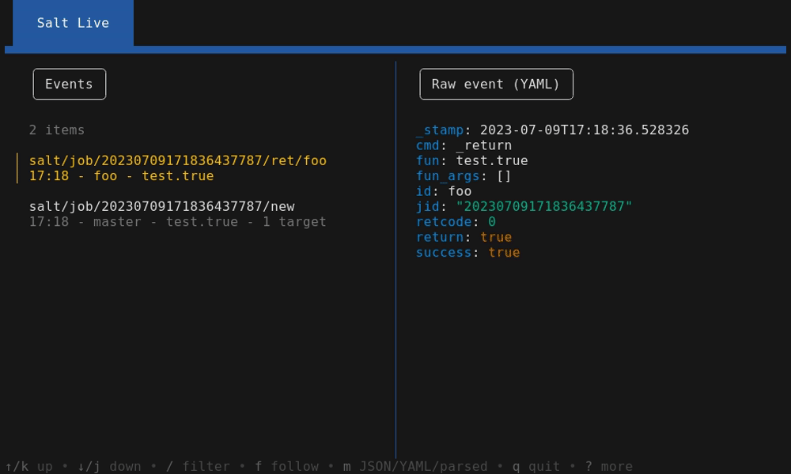

[](https://github.com/kpetremann/salt-exporter)
[](https://github.com/kpetremann/salt-exporter/releases)
[](https://github.com/kpetremann/salt-exporter)
[](https://github.com/kpetremann/salt-exporter/actions/workflows/go.yml)
[](https://github.com/kpetremann/salt-exporter/blob/main/LICENSE)

# Salt tools

## Salt Exporter

`Salt Exporter` is a Prometheus exporter for [Saltstack](https://github.com/saltstack/salt) events. It exposes relevant metrics regarding jobs and results.

This exporter is passive. It does not use the Salt API.

It works out of the box: you just need to run the exporter on the same user as the Salt Master.

```
$ ./salt-exporter
```

``` promql
$ curl -s 127.0.0.1:2112/metrics

salt_expected_responses_total{function="cmd.run", state=""} 6
salt_expected_responses_total{function="state.sls",state="test"} 1

salt_function_responses_total{function="cmd.run",state="",success="true"} 6
salt_function_responses_total{function="state.sls",state="test",success="true"} 1

salt_function_status{minion="node1",function="state.highstate",state="highstate"} 1

salt_new_job_total{function="cmd.run",state="",success="false"} 3
salt_new_job_total{function="state.sls",state="test",success="false"} 1

salt_responses_total{minion="local",success="true"} 6
salt_responses_total{minion="node1",success="true"} 6

salt_scheduled_job_return_total{function="state.sls",minion="local",state="test",success="true"} 2
```

## Salt Live

!!! tip "`salt-run state.event pretty=True` under steroids"

`Salt Live` is a Terminal UI tool to watch events in real time.

Check out the full demo **[here](./salt-live/usage.md)**.

[](./demo/tui-overview.webm)
