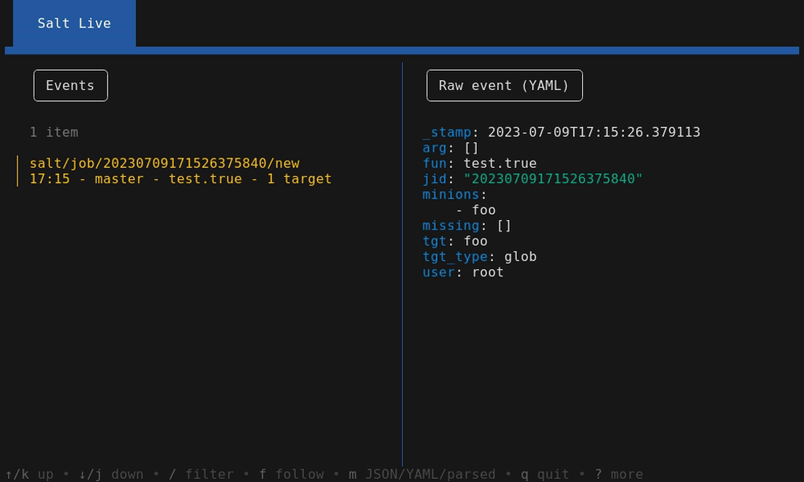

---
hide:
    - toc
---
# Usage

## Tutorial

## Hard filter

You can run `Salt Live` with the `-hard-filter` flag.

Unlike the filter in the TUI (using ++slash++), all events not matching the filter are definitely discarded.

## Keyboard shortcuts

| Key               | Effect                                                                |
|-------------------|-----------------------------------------------------------------------|
| ++q++             | Exit.                                                                 |
| ++slash++         | Display the prompt to edit the filter.                                |
| ++up++ / ++down++ | Navigate in the list. This stops the refresh of the list.             |
| ++f++             | Follow mode: resume the refresh of the event list.                    |
| ++m++             | Change output format of the side panel (YAML, JSON, Golang structure).|
| ++w++             | Toggle word wrap (only in JSON mode).                                 |
